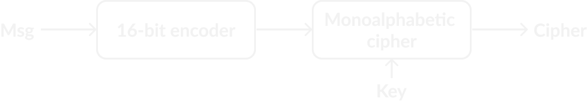
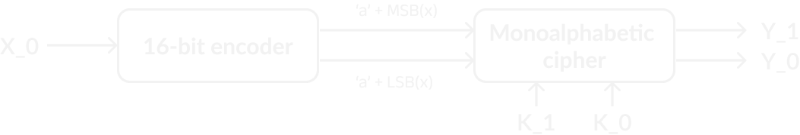
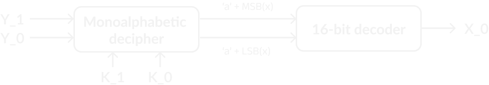

## CTF 6

### Problem
> The attackers have developed an unbreakable encryption, can you break it? When you break it decrypt the ciphertext found in cipher.txt

### Solution
> The enemies are making a move. We need to act fast.

### Hint
- the key is only one character 

### Tools
- python
- string library

### Encryption Algorithm Flow
 

let \
$ Message = X_n, X_{n-1}, .... X_0 $ \
$Key\%16 = K_{2n}, .... K_0$ \
$Cipher = Y_{2n}, ... Y_0$  \
\
$\therefore Y_1 = (\text{ MSB}(X_0) + K_1)\%16 + \text{'a'}$ \
$\therefore Y_0 = (\text{ LSB}(X_0) + K_0)\%16 + \text{'a'}$ 

 

### Decryption Algorith Flow
 

### Attack Analysis
using brute force attack to generate 3 possible message
- only characters we need to try are from `'a'+[0-15]` making bruteforce solution $O(16^{2n})$
- using hint _(key = one character)_ we could simplify ___Monoalphabetic algorithm___ to ___Casear algorithm___ making bruteforce solution only $O(16)$ 
- with $16$ possible output message we could minimize it more by checking on all characters if it's ascii 
    - typically ascii character is `7-bit` number from (0-127) we can reject any key will result `1` on the `8-bit` 
    - we could use `isascii()` in python code
    - > this clean 16 messages to 3 messages without a look
- if there's no hint we will need to utilize `character frequency diagrams` to decrease solution space


### Folder Structure
```
.
└── CTF-6 (New Encryption)/
    ├── encrypt.py                  # encryption algorithm code
    ├── decrypt.py                  # decryption algorithm code 
    ├── attack.py                   # attack algorithm code 
    ├── cipher.txt                  # include cipher need to attack (attack.py read this file) 
    ├── possible_results.txt        # possible results of bruteforce attack (attack.py output this file) 
    └── README
```

