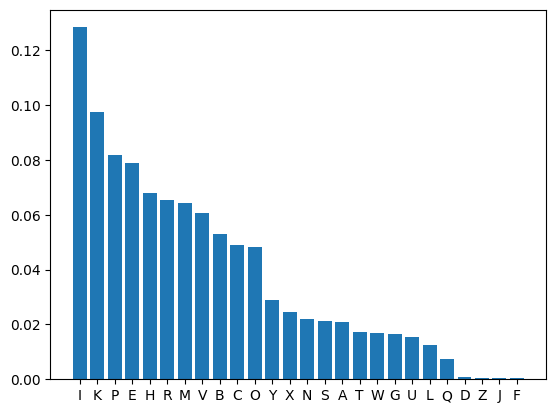

### Problem Statement
We have a long encrypted text where we should use cryptanalysis to decrypt it.
- Encrypted Text:
`ECRAI YEV TISRMMRMS KP SIK QIBW KRBIO...`

### Analysis
##### Using Ceaser Cipher
```python:
def decrypt_caesar(ciphertext, shift):
    return ''.join(chr(((ord(char) - ord('A') - shift) % 26) + ord('A')) for char in ciphertext if char.isalpha())  # Only decrypt letters
```
Trying the Caesar cipher with different shift values couldn't extract the original message. It's possible that the text is encrypted using a different method or a more complex cipher. Further analysis and experimentation may be needed to decrypt the text successfully.
##### Frequency Analysis with monoalphabetic substitution

Using frequency analysis, I analyzed the distribution of letters in the encrypted text and compared it to the expected frequency distribution of letters in English text. By identifying common patterns and frequencies, I attempted to map the encrypted letters to their plaintext counterparts. 
```python:
def frequency_analysis(ciphertext):
    total = sum(char.isalpha() for char in ciphertext)
    freq = Counter(char for char in ciphertext if char.isalpha())
    normalized_freq = {char: count / total for char, count in freq.items()}
    sorted_freq = sorted(normalized_freq.items(), key=lambda x: x[1], reverse=True)
    # Most common English letters
    most_common_letters = 'ETAOINSHRDLCUMWFGYPBVKJXQZ'  
    mapping = {char: most_common_letters[i] for i, (char, _) in enumerate(sorted_freq)}
    return mapping, sorted_freq
```
Additionally, by considering permutations of letters with close frequencies such as `P & E` | `H & R & M & V`, I further refined the decryption process, which eventually led to successfully decrypting the text.

```
ALICE WAS BEGINNING TO GET VERY TIRED OF SITTING BY HER SISTER ON THE
BANK AND OF HAVING NOTHING TO DO ONCE OR TWICE SHE HAD PEEPED INTO THE
BOOK HER SISTER WAS READING BUT IT HAD NO PICTURES OR CONVERSATIONS IN
IT AND WHAT IS THE USE OF A BOOK THOUGHT ALICE WITHOUT PICTURES OR
CONVERSATIONS

SO SHE WAS CONSIDERING IN HER OWN MIND AS WELL AS SHE COULD FOR THE
DAY MADE HER FEEL VERY SLEEPY AND STUPID WHETHER THE PLEASURE OF
MAKING A DAISYCHAIN WOULD BE WORTH THE TROUBLE OF GETTING UP AND
PICKING THE DAISIES WHEN SUDDENLY A WHITE RABBIT WITH PINK EYES RAN
CLO....
```
**The rest of the decrypted text could be found in `decrypted_text.txt`**
