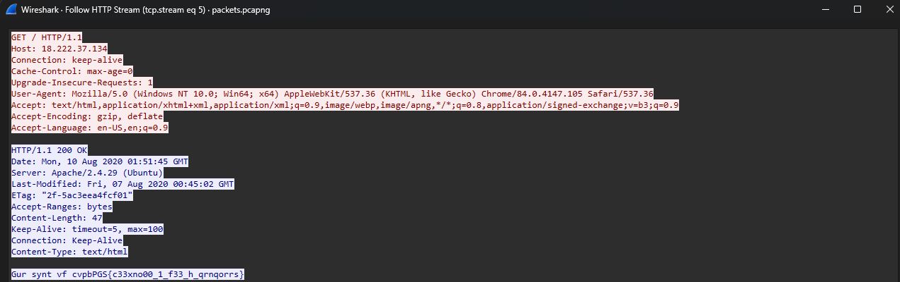

### Problem Statement
We have `packets.pcapng` that holds captured packets.

### Analysis
##### Using Wireshark to Extract Packets
After following the Http Stream I found the packet with the encrypted message (Flag)

```
GET / HTTP/1.1
Host: 18.222.37.134
Connection: keep-alive
Cache-Control: max-age=0
Upgrade-Insecure-Requests: 1
User-Agent: Mozilla/5.0 (Windows NT 10.0; Win64; x64) AppleWebKit/537.36 (KHTML, like Gecko) Chrome/84.0.4147.105 Safari/537.36
Accept: text/html,application/xhtml+xml,application/xml;q=0.9,image/webp,image/apng,*/*;q=0.8,application/signed-exchange;v=b3;q=0.9
Accept-Encoding: gzip, deflate
Accept-Language: en-US,en;q=0.9

HTTP/1.1 200 OK
Date: Mon, 10 Aug 2020 01:51:45 GMT
Server: Apache/2.4.29 (Ubuntu)
Last-Modified: Fri, 07 Aug 2020 00:45:02 GMT
ETag: "2f-5ac3eea4fcf01"
Accept-Ranges: bytes
Content-Length: 47
Keep-Alive: timeout=5, max=100
Connection: Keep-Alive
Content-Type: text/html

Gur synt vf cvpbPGS{c33xno00_1_f33_h_qrnqorrs}

```
**Encrypted Flag:**
`Gur synt vf cvpbPGS{c33xno00_1_f33_h_qrnqorrs}
`
After Applying Ceaser Cipher with shifting (Rotation) value `13`
```python:
text = 'Gur synt vf cvpbPGS{c33xno00_1_f33_h_qrnqorrs}'

def rot13(text):
    result = ''
    for c in text:
        if c.isalpha():
            if c.islower():
                result += chr((ord(c) - ord('a') + 13) % 26 + ord('a'))
            else:
                result += chr((ord(c) - ord('A') + 13) % 26 + ord('A'))
        else:
            result += c
    return result

decrypted_flag = rot13(text)
```
###### Finally the output:
`The flag is picoCTF{p33kab00_1_s33_u_deadbeef}`